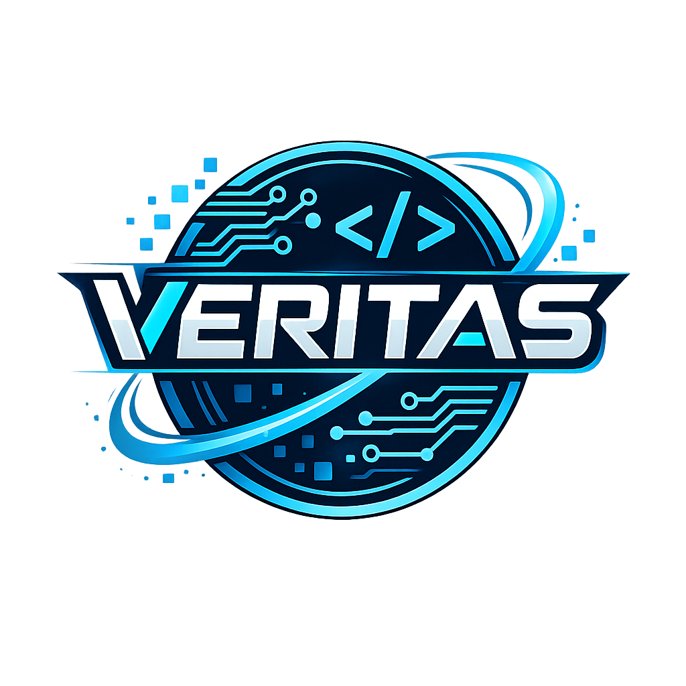

#  Daegun26Veritas: AI & Data Science Club

> **데이터를 통해 세상을 읽고, AI로 문제를 해결하는 대건고 베리타스입니다.**

---

## 🚀 퀵 스타트 (부원 필수 확인)
동아리 활동을 시작하기 전, 아래 문서들을 순서대로 읽고 환경을 설정해 주세요.

1.  **[환경 설정 가이드](./docs/guides/01_getting_started.md)**: Codespaces 설정 및 과제 제출 방법
2.  **[협업 컨벤션](./docs/convention.md)**: 커밋 메시지 및 PR 제목 규칙 (중요!)
3.  **[질문하기](https://github.com/kimgamin2984/Daegun26Veritas/issues/new)**: 에러 해결이 안 될 땐 이슈 탭을 활용하세요.

---

## 📅 2026 연간 커리큘럼

### 🌸 1학기: 파이썬 및 데이터 분석 기초
| 차시 | 주제 | 주요 내용 |
|:---:|:---|:---|
| 1-5 | **Python Basics** | 환경 설정, 제어문, 자료구조 기초 |
| 6-9 | **Data Analysis** | NumPy, Pandas를 활용한 데이터 핸들링 |
| 10-13 | **Visualization** | Matplotlib, Seaborn 시각화 및 전처리 |
| 14-17 | **1학기 프로젝트** | 공공데이터 분석 및 인사이트 도출 |

### 🍂 2학기: 머신러닝 및 AI 프로젝트
| 차시 | 주제 | 주요 내용 |
|:---:|:---|:---|
| 1-4 | **ML Intro** | Scikit-learn 기초, 회귀 및 분류 모델 |
| 5-8 | **Algorithms** | 의사결정나무, 랜덤 포레스트, 성능 평가 |
| 9-12 | **Deep Learning** | 신경망 기초 및 생성형 AI 트렌드 학습 |
| 13-17 | **Capstone** | 팀별 AI 모델 구현 및 최종 컨퍼런스 |

---

## 📂 저장소 구조 가이드
- **`curriculum/`**: 멘토가 배포하는 주차별 주피터 노트북(.ipynb) 자료
- **`submissions/`**: 개인별 과제 제출 공간 (`submissions/[학년]_year/[이름]/`)
- **`projects/`**: 팀별 프로젝트 결과물 저장소
- **`docs/`**: 동아리 운영 지침 및 각종 가이드 문서

---

## 🤝 멘토 정보
- **Mentor**: 김가민(kimgamin2984)
- **Contact**: dg2620503@daegun.hs.kr
- **Notice**: 모든 제출물은 생기부 작성의 중요한 근거 자료가 됩니다. 성실히 참여해 주세요!
